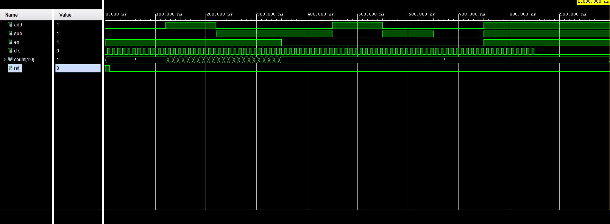

# THE CLOCK
"here i would put my poster"

"IF I HAD IT FINISHED!
## Team Members :
1. Matej Nachtnebel (responsible for connecting the modules together)
2. Tomáš Trenčanský (responsible for graphical output and organization)
3. John Sergis (responsible for coding modules)
4. Mesk Lashin (responsible for coding modules)

## Descritpion
Our team decided to build not just a clock, but **THE Clock**. We built your typical clock features into it, like a stopwatch, a timer, an alarm, and of course, a digital clock. Our Clock is not using any external peripherals, just the Nexys A7 50-T board and it's built in seven segment display and buttons. 

But what do each of the buttons do? It's quite simple :
1. Left and Right buttons are for changing modes
2. Up and Down buttons are for setting the time
3. Center button is for activating the functions

We also built in the function where if you hold the button for a few the speed of change increases.

## Schematic
"here would be a very amazing schematic"

"IF I HAD ANY"

# Individual components
## Input
We also used component [Clock enable](https://github.com/tomas-fryza/vhdl-labs/blob/master/solutions/lab5-counter/clock_en.vhd) which was covered in class and therefore won't be shown here
### [UD counter](https://github.com/TomasTrencansky/VHDL_Clock/blob/main/components/UD%20counter/UD_counter.vhd)
changes mode of the clock

### [Mode](https://github.com/TomasTrencansky/VHDL_Clock/blob/main/components/Mode/Mode.vhd)
counts up and down

### [Speed up](https://github.com/TomasTrencansky/VHDL_Clock/blob/main/components/Speed%20up/Speedup.vhd)
Speeds up change when you hold

### [Change](https://github.com/TomasTrencansky/VHDL_Clock/blob/main/components/Change/Change.vhd)
Allows you to set the time on different modes

