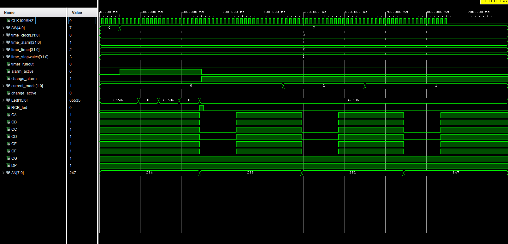

# THE CLOCK

 

## Team Members :
1. Matej Nachtnebel (responsible for connecting the modules together, inputs and output module,temp schematic)
2. Tomáš Trenčanský (responsible for graphical output and organization)
3. John Sergis (responsible for coding modules (alarm,clock,timer,stopwatch))
4. Mesk Lashin (responsible for coding modules (alarm,clock,timer,stopwatch))

## Descritpion
Our team decided to build not just a clock, but **THE Clock**. We built your typical clock features into it, like a stopwatch, a timer, an alarm, and of course, a digital clock. Our Clock is not using any external peripherals, just the Nexys A7 50-T board and it's built in seven segment display and buttons. 

But what do each of the buttons do? It's quite simple :
1. Left and Right buttons are for changing modes
2. Up and Down buttons are for setting the time
3. Center button is for activating the functions

We also built in the function where if you hold the button for a few the speed of change increases.

## Schematic temp

# Individual components

## [Input](https://github.com/TomasTrencansky/VHDL_Clock/blob/main/components/input/Input.vhd)
This component processes button inputs for clock and generates controlling signals for the rest of components (for example clock, alarm, timer...)

Input consists of 5 components. Some of them are used multiple times. It has 6 inputs and 7 outputs. 

Components:
* Edge_detector
* Change
* Mode
* Speed up
* [Clock enable](https://github.com/tomas-fryza/vhdl-labs/blob/master/solutions/lab5-counter/clock_en.vhd)

Generics:
* Long press time = number of periods of clk, until long press is registered 
* NT_speed_up = number of periods of clk, until speed of generation of pulses increases 
* DF_speed = starting speed of generation
* S2_speed = 2nd speed of generation
* S3_speed = 3rd speed of generation
* S4_speed = 4th speed of generation

Inputs:
* BNTU = upper buttton input
* BTND = lower button input
* BTNL = left button input 
* BTNR = right button input
* BTNC = center button input
* CLK100MHz = clock input

Outputs:
* change_en_timer = signal which enables change time for timer
* change_en_clock = signal which enables change time for clock 
* change_en_alarm = signal which enables change time for alarm
* change_blink = is '1' when change of clock, alarm or clock are '1'
* time_sub = signal for subtracting time
* time_add = signal for adding time
* mode_out = outputs current mode of clock

Simulation

Schematic 

### [UD counter](https://github.com/TomasTrencansky/VHDL_Clock/blob/main/components/UD%20counter/UD_counter.vhd)
UD counter is simple synchronous counter which has 5 inputs and one output. You can easily configure range of counting by setting generic value called NBITS. This range is allways 2^NBITS. 

Generic:
* NBITS = number of counter bits 

Inputs :
* clk - input for clock signal 
* en - if value is set to 1, enables counting 
* add- if value is set to 1, then every rising edge of clk adds one
* sub- if value is set to 1, every rising edge of clk adds one
* rst - resets counter

Output :
* count - current number on the counter

Simulation

### [Mode](https://github.com/TomasTrencansky/VHDL_Clock/blob/main/components/Mode/Mode.vhd)
Mode is made of 2 different components which work together to switch betweeen modes of clock. It has 4 inputs and one output.  It is set up to count from 0 to 2, because clock has 3 modes. Duration of needed press is easily adjustable by generic value of Long_press_time ( 1s = 200 000 000 for clock 10 MHz)
Modes:
* Clock & Alarm "00"  (0)
* Stopwatch "01"      (1)
* Timer "10"          (2)

Generic:
* Long press time = number of periods of clk, until long press is registered 

Inputs
* clk = input for clock signal
* en = enables change of mode 
* btnl = input for button left
* btnr = input for button right
Output
* current_mode = outputs 2 bits with value between 0 and 2 

Componets:
* UD_counter - simple use of counter to keep track of mode 
* clock_enable - used for dection of long press

Simulation

Schematic

### [Speed up](https://github.com/TomasTrencansky/VHDL_Clock/blob/main/components/Speed%20up/Speedup.vhd)
Speed up is simple component, which increases the number of generated pulses with thhe duration of button press. It has 4 speeds of pluse generation. 
Duration and periods after which it genenrates pulses are easily configurable by generics. It has 3 inputs and sigle output for pulses. 

Generics:
* NT_speed_up = number of periods of clk, until speed of generation of pulses increases 
* DF_speed = starting speed of generation
* S2_speed = 2nd speed of generation
* S3_speed = 3rd speed of generation
* S4_speed = 4th speed of generation

Inputs
* clk = input for clock signal
* Btn = input signal
* rst = resets speed to frist level

Output 
* pulse = output signal

Simulation

### [Change](https://github.com/TomasTrencansky/VHDL_Clock/blob/main/components/Change/Change.vhd)
Depending on inputs, this component sets right outputs to '1' until they are reset to '0' by rst input. Only one of change outputs (0,1,2) can be '1' at one time.
Component change has 5 inputs and 4 outputs. 

Inputs
* clk = input for clock signal
* Input_pulse_1 = input signal
* Input_pulse_2 = input signal
* rst = sets all outputs to '0'
* current_mode= 2bit input signal 

Outputs
* change_0 = changes to '1' if mode is '00' and Input_pulse_1 is '1' 
* change_1 = changes to '1' if mode is '00' and Input_pulse_2 is '1' 
* change_2 = changes to '1' if mode is '10' and Input_pulse_1 is '1' 
* change_active = when one of changes (1,2,3) is '1' change_active is also '1'

Simulation  

### [Edge Detector](https://github.com/TomasTrencansky/VHDL_Clock/blob/main/components/Edge%20Detector/Edge_detector.vhd)
Simple component which generates a pulse on rising edge of input signal. It has 2 inputs and 1 output

Inputs:
* Sig_in = input for signal 
* clk = input for clock signal

Output:
* Edge_detected = output of pulses

Simulation

## [Output](https://github.com/TomasTrencansky/VHDL_Clock/blob/main/components/Output/Output.vhd)
This component processes outputs from clock, alarm, timer, stopwatch. Automatically switches bettween 7 segment displays
and outputing right part of input signal. Depending on current state of inputs. It has basic PWM modulation for display and waking lights.

Generics:
* Period = sets period for pwm
* N_blink_periods = number of clk periods for between blinking
* N_Slow_wake_up = number periods of clk till increasing duty by 1

Components:
* Mx2
* Mx4
* Mx8
* bin2seg
* clock_enable
* An_shifter
* Blink
* On For N

Inputs:
* CLK100MHZ = input for clock signal 
* timer_runout = high if timer finishes 
* alarm_active = high if alarm is "ringig"
* change_alarm = high if you are able to change value of alarm
* change_active = high if one from clock, alarm, timer is in change mode 
* SW (5bits) = input for brightness of display 
* time_clock (32bits) = input of time from clock
* time_alarm (32bits) = input of time from alarm
* time_timer (32bits) = input of time from timer
* time_stopwatch (32bits) = input of time from stopwatch
* current_mode (2bit) = input for current mode of clock

Outputs:
* RGB_led
* CA = output for 7-segment display
* CB = output for 7-segment display
* CC = output for 7-segment display
* CD = output for 7-segment display
* CE = output for 7-segment display
* CF = output for 7-segment display
* CG = output for 7-segment display
* DP = output for 7-segment display
* AN (8bit) = sets active 7-segment display
* Led (16bit) = output for green LEDs

Simulation

Schematic

### [MX2](https://github.com/TomasTrencansky/VHDL_Clock/blob/main/components/MX2/MX2.vhd)
Synchronous multiplexor for 2 data inputs and one data output. Depending on set input switches which input is on output. Value can switch only when en is high. Nunber of bits in input is easily set by generic value N_bits.

Generic:
* N_bits = number of input bits 

Inputs:
* clk = input for clock signal 
* en  = signal which enables change of value 
* set = input for setting which input is output (1bit)
* IN0 = input data
* IN1 = input data 

Output
* Mx_out = output data 

Simulation

### [MX4](https://github.com/TomasTrencansky/VHDL_Clock/blob/main/components/MX4/Mx4.vhd)
Synchronous multiplexor for 4 data inputs and one data output. Depending on set input switches which input is on output. Value can switch only when en is high. Nunber of bits in input is easily set by generic value N_bits.

Generic:
* N_bits = number of input bits

Inputs:
* clk = input for clock signal 
* en  = signal which enables change of value 
* set = input for setting which input is output (2bit)
* IN0 = input data
* IN1 = input data 
* IN2 = input data
* IN3 = input data
  
Output
* Mx_out = output data

  
Simulation

### [MX8](https://github.com/TomasTrencansky/VHDL_Clock/blob/main/components/MX8/MX8.vhd)
Synchronous multiplexor for 8 data inputs and one data output. Depending on set input switches which input is on output. Value can switch only when en is high. Nunber of bits in input is easily set by generic value N_bits.

Generic:
* N_bits = number of input bits

Inputs:
* clk = input for clock signal 
* en  = signal which enables change of value 
* set = input for setting which input is output (3bit)
* IN0 = input data
* IN1 = input data 
* IN2 = input data
* IN3 = input data
* IN4 = input data
* IN5 = input data 
* IN6 = input data
* IN7 = input data
  
Output
* Mx_out = output data

Simulation

### [Blink](https://github.com/TomasTrencansky/VHDL_Clock/blob/main/components/Blink/Blink.vhd)
Simple component which after N number of clock signal negates value of output. Output is constanly high if en is low. If en is high it switches output between 1 or 0. It is made from 2 components. 

Components:
* Flip Flop
* Clock enable

Generic:
* Blink_N_periods = number of clk periods for between blinking

Inputs:
* clk = input for clock signal 
* en = enables blinking if high

Output:
* blink_out = output signal 
      
Simulation

Schematic

### [Flip Flop](https://github.com/TomasTrencansky/VHDL_Clock/blob/main/components/Flip%20Flop/Flip_Flop.vhd) 
Flip flop flips state of output on rising edge of clock if en is high. If rst is high output returns to default value Q_out 0 and Q_out_neg 1.

Inputs:
* clk = input for clock singal 
* rst = reset input 
* en  = enables switching

Outputs:
* Q_out = normal output
* Q_out_neg = negated output

Simulation

### [AN shifter](https://github.com/TomasTrencansky/VHDL_Clock/blob/main/components/AN%20Shifter/An_shifter.vhd)
AN shifter moves position of 0 to left when en is high every rising edge. AN is 8bits long with only one 0. 0 is active seven segement display. We are using 8 segments so we have to cycle through all of them. 

Inputs:
* clk = input for clock signal 
* en  = enables switching 
* rst = resets output value to default  (AN = "11111110" , Digit = "000")
  
Outputs:
* AN = outputs current AN (8bit)
* Digit = order of current displaying digit (3bit)

Simulation

### [On For N](https://github.com/TomasTrencansky/VHDL_Clock/blob/main/components/On%20For%20N/On_For_N.vhd)
Part of crude Pwm modulator in output. After recieving pulse on start_c output is held high until N periods of clk pass. It has 2 genrics which set number of clk periods per one period of "pwm" (N_Period) and number periods of clk untill increasing duty by 1 (N_Slow_wake_up). This pwm has 25 states so 1 step is 4% duty.

It has two modes:
* mode = 0 = then N is set by 5bit period input
* mode = 1 = then N is after certain number of periods rises duty by 1. Slowly to max

Generics:
* N_Period = number of clk periods per one period of pwm
* N_Slow_wake_up = number periods of clk till increasing duty by 1
  
 Inputs:
* clk = input for clock signal 
* rst = resets output to 0
* start_c = input for start pulse 
* mode = sets mode 
* period (5 bits)

Outputs:
* duty_sig = output signal 

Simulation

Mode 0

Mode 1

 
## Clock modules

### [DX2](https://github.com/TomasTrencansky/VHDL_Clock/blob/main/components/DX2/DX2.vhd)
Synchronous demultiplexor for 1 data inputs and 2 data outputs. Depending on set input switches which output carries the input signalt. Value can switch only when en is high. Nunber of bits in input is easily set by generic value N_bits.

Generic:
* N_bits = number of input bits

Inputs:
* clk = input for clock signal 
* en  = signal which enables change of value 
* set = input for setting which input is output (2bit)
* IN0 = input data
  
Output
* dx_out0 = output data
* dx_out1 = output data

Simulation

### [UD counter signaling](https://github.com/TomasTrencansky/VHDL_Clock/blob/main/components/UD_counter_signaling/UD_counter_signaling.vhd)
UD counter is simple synchronous counter which has 5 inputs and one output. You can easily configure range of counting by setting generic value called NBITS. This range is allways 2^NBITS. 

Generic:
* NBITS = number of counter bits
* Count_range = range of counting

Inputs :
* clk - input for clock signal 
* en - if value is set to 1, enables counting 
* add - if value is set to 1, then every rising edge of clk adds one
* sub - if value is set to 1, every rising edge of clk adds one
* rst- resets counter

Output :
* count - current number on the counter
* sub_out - lower overflow
* add-out - upper overflow

Simulation

### [Clock](https://github.com/TomasTrencansky/VHDL_Clock/blob/main/components/Clock/clock.vhd)
This component makes the clock mode tick. It is composed of 3 components, has 5 inputs and 1 output. The output has 32 bits, witch every 4 bits carrying information about a different number.

Components:
* UD counter signaling
* MX2
* DX2

Inputs:
* clk1ms - same as clk, but with different period
* change - allows changing of time
* add - if value is set to 1, then every rising edge of clk adds one
* sub - if value is set to 1, every rising edge of clk adds one
* sw - changes clock format
* clk - input for clock signal 

Outputs:
* time_out - 32-bit, each number of the clock is carried in 4-bits

Schematic

### [Stopwatch](https://github.com/TomasTrencansky/VHDL_Clock/tree/main/components/stopwatch)
This component is what makes the stopwatch mode tick.

Components:
* UD counter signaling
* MX2
* Flip_Flop

Inputs:
* btn - button input, activates stopwatch
* long_btn - long press button input, resets stopwatch
* clk - input for clock signal 
* clk1ms - same as clk, but with different period

Outputs:
* time_out - 32-bit, each number of the clock is carried in 4-bits

### [Timer](https://github.com/TomasTrencansky/VHDL_Clock/blob/main/components/TImer/Timer.vhd)
This compoment is what makes timer tick.

Components:
* Set Time Value
* Countdown

Inputs:
* button - button input, activates stopwatch
* long_button - long press button input, resets timer
* add - adds time on the timer
* sub - lowers the time on the timer
* change - allows you to set the time
* clk - input for clock signal 
* clk1ms - same as clk, but with different period

Outputs:
* time_out - 32-bit, each number of the clock is carried in 4-bits
* Timer_runout - output is 1 when the timer runs out

### [Set Time Value]()
Allows you to set time on timer

Inputs:
* add - adds time on the timer
* sub - lowers the time on the timer
* change - allows you to set the time
* clk - input for clock signal 

Outputs:
* time_out - 32-bit, each number of the clock is carried in 4-bits

### [Countdown](https://github.com/TomasTrencansky/VHDL_Clock/blob/main/components/Countdown/Countdown.vhd)
Part of TImer that counts the time down.

Inputs:
* clk - input for clock signal
* clk1ms - same as clk, but with different period
* btn - button input, activates stopwatch
* change - allows you to set the time
* set_time_in - signal which carries how much time was set
* long_btn - resets countdown

Outputs:
* time_out - 32-bit, each number of the clock is carried in 4-bits
* time_run_out - sends a signal when time runs out

