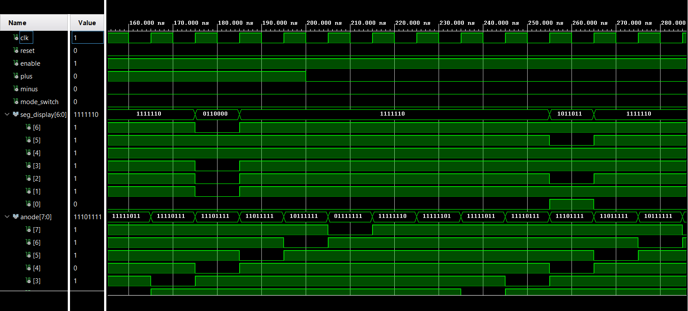

# -THE CLOCK-

 

## Team Members :
1. Matej Nachtnebel (responsible for connecting the modules together, inputs and output module)
2. Tomáš Trenčanský (responsible for graphical output and organization)
3. John Sergis (responsible for coding modules (alarm,clock,timer,stopwatch))
4. Mesk Lashin (responsible for coding modules (alarm,clock,timer,stopwatch))

## Descritpion
Our team decided to build not just a clock, but **THE Clock**. We built your typical clock features into it, like a stopwatch, a timer, an alarm, and of course, a digital clock. Our Clock is not using any external peripherals, just the Nexys A7 50-T board and it's built in seven segment display and buttons. 

But what do each of the buttons do? It's quite simple :
1. Left and Right buttons are for changing modes
2. Up and Down buttons are for setting the time
3. Center button is for activating the functions

We also built in the function where if you hold the button for a few the speed of change increases.

## Schematic

# Individual components

## [Input](https://github.com/TomasTrencansky/VHDL_Clock/blob/main/components/input/Input.vhd)
This component processes button inputs for clock and generates controlling signals for the rest of components (for example clock, alarm, timer...)

Input consists of 5 components. Some of them are used multiple times. It has 6 inputs and 7 outputs. 

Components:
* Edge_detector
* Change
* Mode
* Speed up
* [Clock enable](https://github.com/tomas-fryza/vhdl-labs/blob/master/solutions/lab5-counter/clock_en.vhd)

Inputs:
* BNTU = upper buttton input
* BTND = lower button input
* BTNL = left button input 
* BTNR = right button input
* BTNC = center button input
* CLK100MHz = clock input

Outputs:
* change_en_timer = signal which enables change time for timer
* change_en_clock = signal which enables change time for clock 
* change_en_alarm = signal which enables change time for alarm
* change_blink = is '1' when change of clock, alarm or clock are '1'
* time_sub = signal for subtracting time
* time_add = signal for adding time
* mode_out = outputs current mode of clock

### [UD counter](https://github.com/TomasTrencansky/VHDL_Clock/blob/main/components/UD%20counter/UD_counter.vhd)
UD counter is simple synchronous counter which has 5 inputs and one output. You can easily configure range of counting by setting generic value called NBITS. This range is allways 2^NBITS. 

Inputs :
* clk - input for clock signal 
* en - if value is set to 1, enables counting 
* add- if value is set to 1, then every rising edge of clk adds one
* sub- if value is set to 1, every rising edge of clk adds one

Output :
* count - current number on the counter

### [Mode](https://github.com/TomasTrencansky/VHDL_Clock/blob/main/components/Mode/Mode.vhd)
Mode is made of 2 different components which work together to switch betweeen modes of clock. It has 4 inputs and one output.  It is set up to count from 0 to 2, because clock has 3 modes. Duration of needed press is easily adjustable by generic value of Long_press_time ( 1s = 200 000 000 for clock 10 MHz)
Modes:
* Clock & Alarm "00"  (0)
* Stopwatch "01"      (1)
* Timer "10"          (2)

Inputs
* clk = input for clock signal
* en = enables change of mode 
* btnl = input for button left
* btnr = input for button right
Output
* current_mode = outputs 2 bits with value between 0 and 2 

Componets:
* UD_counter - simple use of counter to keep track of mode 
* clock_enable - used for dection of long press

### [Speed up](https://github.com/TomasTrencansky/VHDL_Clock/blob/main/components/Speed%20up/Speedup.vhd)
Speed up is simple component, which increases the number of generated pulses with thhe duration of button press. It has 4 speeds of pluse generation. 
Duration and periods after which it genenrates pulses are easily configurable by generics. It has 3 inputs and sigle output for pulses. 

Inputs
* clk = input for clock signal
* Btn = input signal
* rst = resets speed to frist level

Output 
* pulse = output signal

### [Change](https://github.com/TomasTrencansky/VHDL_Clock/blob/main/components/Change/Change.vhd)
Depending on inputs, this component sets right outputs to '1' until they are reset to '0' by rst input. Only one of change outputs (0,1,2) can be '1' at one time.
Component change has 5 inputs and 4 outputs. 

Inputs
* clk = input for clock signal
* Input_pulse_1 = input signal
* Input_pulse_2 = input signal
* rst = sets all outputs to '0'
* current_mode= 2bit input signal 

Outputs
* change_0 = changes to '1' if mode is '00' and Input_pulse_1 is '1' 
* change_1 = changes to '1' if mode is '00' and Input_pulse_2 is '1' 
* change_2 = changes to '1' if mode is '10' and Input_pulse_1 is '1' 
* change_active = when one of changes (1,2,3) is '1' change_active is also '1'
  

### [Edge Detector](https://github.com/TomasTrencansky/VHDL_Clock/blob/main/components/Edge%20Detector/Edge_detector.vhd)
Simple component which generates a pulse on rising edge of input signal. It has 2 inputs and 1 output

Inputs:
* Sig_in = input for signal 
* clk = input for clock signal

Output:
* Edge_detected = output of pulses 

## [Output]()

### [MX2](https://github.com/TomasTrencansky/VHDL_Clock/blob/main/components/MX2/MX2.vhd)

### [MX4](https://github.com/TomasTrencansky/VHDL_Clock/blob/main/components/MX4/Mx4.vhd)

### [MX8](https://github.com/TomasTrencansky/VHDL_Clock/blob/main/components/MX8/MX8.vhd)

### [Blink](https://github.com/TomasTrencansky/VHDL_Clock/blob/main/components/Blink/Blink.vhd)

### [Flip Flop](https://github.com/TomasTrencansky/VHDL_Clock/blob/main/components/Flip%20Flop/Flip_Flop.vhd) 

### [AN shifter](https://github.com/TomasTrencansky/VHDL_Clock/blob/main/components/AN%20Shifter/An_shifter.vhd)

### [On For N]()

## Clock modules

### Clock/alarm

